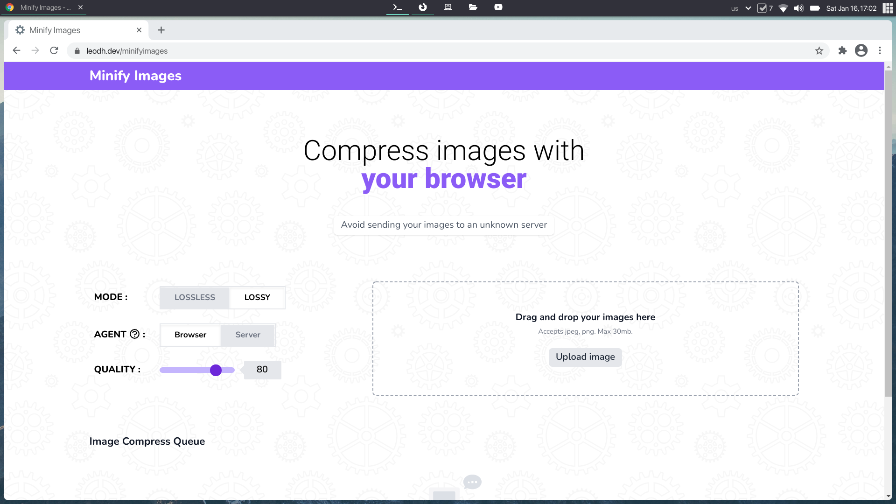

# [Minify Images](https://projects.leodh.dev/minifyimages)

> Simple frontend browser application to bulk compress images either through
> the browser or using a backend server.
>
> Built with Preact + TailwindCSS + Express

## Other Documentation

- [**Frontend**](./minifyimages-preact/README.md)
- [**Server**](./minifyimages-expresjs/README.md)

## Misc

### Initial Repositories (before merge)

- [Frontend](https://github.com/leo-dh/minifyimages-preact)
- [Server](https://github.com/leo-dh/minifyimages-expressjs)
